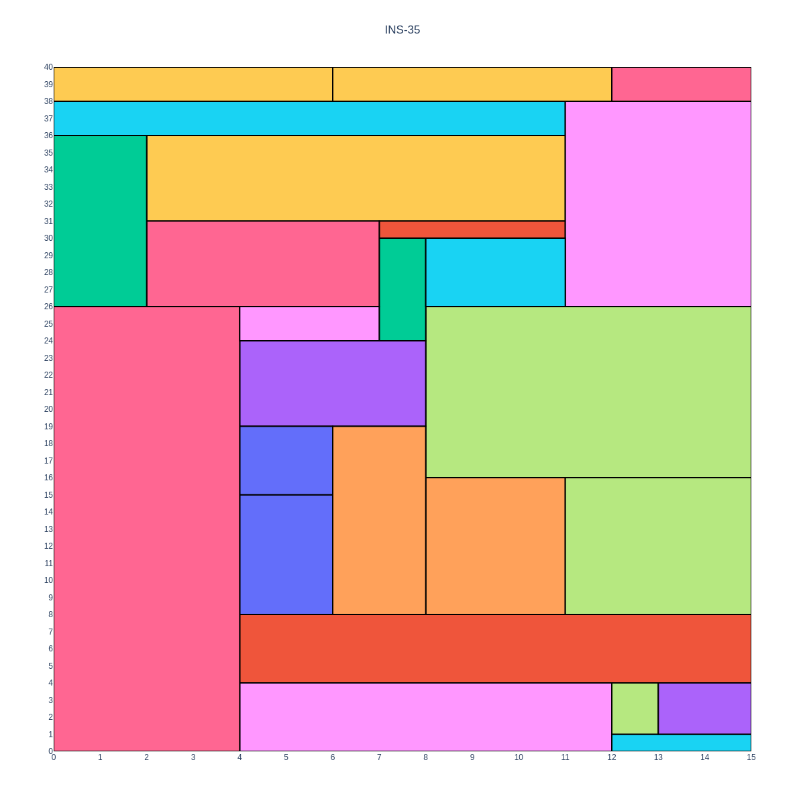

# Linear Programming

This directory contains the python script to solve the VLSI problem using LP, in particular CPLEX.

## Installation

To install the required conda environment, please refer to the [repository readme](../../README.md)

You also need to install CPLEX on your machine. Please refer to [this guide](https://github.com/IBMPredictiveAnalytics/Simple_Linear_Programming_with_CPLEX/blob/master/cplex_instruction.md).  

## Usage

You can run the LP solver using:

```shell
python3 run.py [-h] [-i INPUT_DIR] [-o OUTPUT_DIR] [-r] [-t TIMEOUT] [-p]
```

Where:
- -i is the directory containing the instances in the DZN format
- -o is the directory where to store the results
- -r allows the rotation of circuits
- -t is the timeout in seconds
- -p is a flag to store the plots within the output directory

The script saves all the found results in a file `out-N.txt`, a `solutions.csv` file to easily compare the results, and, in case the `-p` flag was set, a `plots` directory containing images as the following one:

